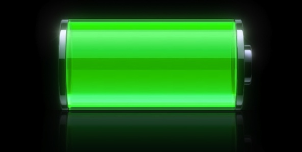
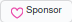

***

##### Top

# `README.md`

***

# Index

[00.0 - Top](#Top)

[01.0 - Index](#Index)

[02.0 - Description](#SeansLifeArchive_Images_Battery)

[03.0 - About](#About)

[04.0 - Wiki](#Wiki)

[05.0 - Version history](#Version-history)

[06.0 - Contributers](#Contributers)

[07.0 - Contributing](#Contributing)

[08.0 - Sponsor info](#Sponsor-info)

[09.0 - Issues](#Issues)

> [09.0.1 - Current issues](#Current-issues)

> [09.0.2 - Past issues](#Past-issues)

> [09.0.3 - Past pull requests](#Past-pull-requests)

> [09.0.4 - Active pull requests](#Active-pull-requests)

[10.0 - Software status](#Software-status)

[11.0 - Resources](#Resources)

[12.0 - About README](#About-README)

[13.0 - README Version history](#README-version-history)

[14.0 - Footer](#You-have-reached-the-end-of-the-README-file)

> [14.9 - EOF](#EOF)

***

# SeansLifeArchive_Images_Battery
The module for my life story project that contains my battery image collection

***

## About

See above

***

## Wiki

[Click/tap here to view this projects Wiki](https://github.com/seanpm2001/SeansLifeArchive_Images_Battery/wiki)

If the project has been forked, the Wiki was likely removed. Luckily, I include an embedded version. You can view it [here](/External/ProjectWiki/).

***

## Version history

Unavailable

[More versions coming soon](https://www.example.com)

***

## Contributers

Currently, I am the only contributer. Contributing is not allowed, as this is a personal project.

> * 1. [seanpm2001](https://github.com/seanpm2001/) - 63 commits (As of Tuesday, March 30th 2021 at 6:31 pm)

> * 2. No other contributers.

***

## Contributing

Contributing is not allowed for this project, as it is a personal project.

[Click/tap here to view the contributing rules for this project](CONTRIBUTING.md)

***

## Sponsor info

 <-- Don't click this button. It doesn't work. It is just an image

You can sponsor this project if you like, but please specify what you want to donate to. [See the funds you can donate to here](https://github.com/seanpm2001/Sponsor-info/tree/main/For-sponsors)

You can view other sponsor info [here](https://github.com/seanpm2001/Sponsor-info/)

Try it out! The sponsor button is right up next to the watch/unwatch button.

***

## Issues

### Current issues

* No current issues

* No other current issues

If the repository has been forked, issues likely have been removed. Luckily I keep an archive of certain images [here](/.github/Issues/)

[Read the privacy policy on issue archival here](/.github/Issues/README.md)

**TL;DR**

I archive my own issues. Your issue won't be archived unless you request it to be archived.

### Past issues

None at the moment

If the repository has been forked, issues likely have been removed. Luckily I keep an archive of certain images [here](/.github/Issues/)

[Read the privacy policy on issue archival here](/.github/Issues/README.md)

**TL;DR**

I archive my own issues. Your issue won't be archived unless you request it to be archived.

### Past pull requests

None at the moment

If the repository has been forked, issues likely have been removed. Luckily I keep an archive of certain images [here](/.github/Issues/)

[Read the privacy policy on issue archival here](/.github/Issues/README.md)

**TL;DR**

I archive my own issues. Your issue won't be archived unless you request it to be archived.

### Active pull requests

None at the moment

If the repository has been forked, issues likely have been removed. Luckily I keep an archive of certain images [here](/.github/Issues/)

[Read the privacy policy on issue archival here](/.github/Issues/README.md)

**TL;DR**

I archive my own issues. Your issue won't be archived unless you request it to be archived.

***

## Software status

All of my works are free some restrictions. DRM (**D**igital **R**estrictions **M**anagement) is not present in any of my works.

This sticker is supported by the Free Software Foundation. I never intend to include DRM in my works.

I am ussing the abbreviation "Digital Restrictions Management" instead of the more known "Digital Rights Management" as the common way of addressing it is false, there are no rights with DRM. The spelling "Digital Restrictions Management" is more accurate, and is supported by [Richard M. Stallman (RMS)](https://en.wikipedia.org/wiki/Richard_Stallman) and the [Free Software Foundation (FSF)](https://en.wikipedia.org/wiki/Free_Software_Foundation)

This section is used to raise awareness for the problems with DRM, and also to protest it. DRM is defective by design and is a major threat to all computer users and software freedom.

Image credit: [defectivebydesign.org/drm-free/...](https://www.defectivebydesign.org/drm-free/how-to-use-label)

***

## Resources

Here are some resources for this project

[Project language file](PROJECT_LANG.asm)

[Unused battery image](iOS6_Charging.png)

***

## About README

File type: `Markdown (*.md)`

File version: `2 (Tuesday, March 30th 2021 at 6:31 pm)`

Line count: `0,288`

***

## README version history

Version 1 (Thursday, October 8th 2020 at 5:45 pm)

> Changes:

> * Started the file

> * Added the title section

> * Added the index

> * Added the about section

> * Added the Wiki section

> * Added the version history section

> * Added the contributors section

> * Added the contributing section

> * Added the about README section

> * Added the README version history section

> * No other changes in version 1

Version 2 (Tuesday, March 30th 2021 at 6:31 pm)

> Changes:

> * Updated the footer

> * Referenced 2 battery images

> * Updated the title section

> * Updated the Wiki section

> * Updated the index

> * Added the sponsor info section

> * Added the issues section with its 4 subsections

> * Added the software status section

> * Added the resources section

> * Updated the contributing section (made the link more efficient)

> * Updated the contributors section

> * Updated the file info section

> * Updated the file history section

> * No other changes in version 2

Version 3 (coming soon)

> Changes:

> * Coming soon

> * No other changes in version 3

Version 4 (coming soon)

> Changes:

> * Coming soon

> * No other changes in version 4

***

### You have reached the end of the README file

( [Back to top](#Top) | [Exit](https://github.com) )

### EOF

***
